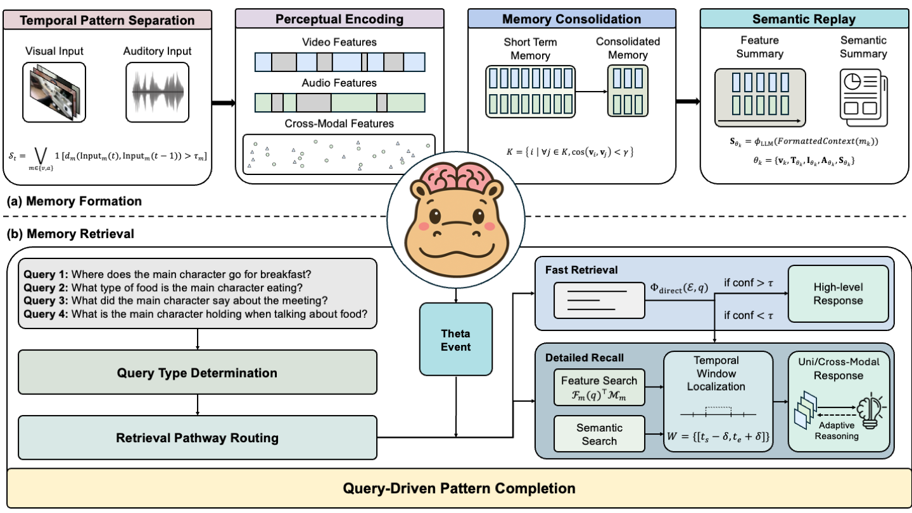

# HippoMM: Hippocampal-inspired Multimodal Memory

[](https://opensource.org/licenses/MIT)
[](https://hippomultimodalmemory.github.io/)
[](https://arxiv.org/abs/2504.10739)
[](https://github.com/linyueqian/HippoVlog/)

HippoMM is a multimodal memory system designed for **long audiovisual event understanding**, drawing inspiration from the biological processes of hippocampal memory formation and retrieval. It integrates visual, audio, and text modalities to create, consolidate, and query memories in a way that mirrors human cognitive functions.

The system aims to address the challenge of comprehending extended audiovisual experiences by implementing computational mechanisms analogous to hippocampal pattern separation, pattern completion, memory consolidation, and cross-modal associative retrieval.



## Core Concepts

HippoMM implements a biologically-inspired multimodal memory system with four main processing stages:

* **Temporal Pattern Separation**: Segments continuous audiovisual streams into meaningful units based on visual changes and audio silence detection. This mimics how the hippocampus separates experiences into distinct episodes.

* **Perceptual Encoding**: Transforms raw inputs into rich multimodal representations using cross-modal features from video frames and audio segments.

* **Memory Consolidation**: Filters redundant segments through similarity-based analysis, preserving only distinct memory events to optimize storage.

* **Semantic Replay**: Generates abstract summaries of consolidated memories using Vision-Language Models, transforming detailed perceptual information into semantic representations called `ThetaEvents`.

The system handles queries through a dual-pathway memory retrieval process:

1. **Fast Retrieval**: Quickly checks semantic summaries for information
2. **Detailed Recall**: Performs deeper analysis when fast retrieval isn't sufficient, including feature search, semantic search, and temporal window localization

## Installation

1.  **Install ImageBind (Prerequisite):**
    ```bash
    mkdir -p pretrained
    cd pretrained
    git clone https://github.com/facebookresearch/ImageBind.git
    cd ImageBind
    pip install .
    cd ..
    ```

    Download the pretrained model:
    ```bash
    mkdir -p imagebind
    wget https://dl.fbaipublicfiles.com/imagebind/imagebind_huge.pth -O imagebind/imagebind_huge.pth
    cd ../..
    ```

2.  **Clone the repository:**
    ```bash
    git clone https://github.com/linyueqian/HippoMM.git
    cd HippoMM
    ```

3.  **Install dependencies:**
    It's recommended to use a virtual environment (e.g., `conda` or `venv`).
    ```bash
    # Using conda (example)
    # conda create -n hippomm python=3.9
    # conda activate hippomm

    pip install -r requirements.txt
    ```

4.  **Configure the system:**
    * Copy the default configuration:
        ```bash
        cp config/default_config.yaml config/config.yaml
        ```
    * Edit `config/config.yaml` and update it with:
        * Paths to your foundation models (ImageBind, Whisper, QwenVL).
        * API keys and base URLs for any external services (e.g., OpenAI API for reasoning or VLM endpoints).
        * Desired storage directories (`storage.base_dir`, etc.).

## Model Serving

HippoMM requires several model serving endpoints to be running for full functionality. These can be set up using either sglang or vllm:

### Qwen VL Model Serving

The system uses Qwen2.5-VL-7B-Instruct for visual-language processing. You can serve it using either:

1. **Using vllm (Recommended):**
   ```bash
   python -m vllm.entrypoints.api_server \
     --model pretrained/Qwen/Qwen2.5-VL-7B-Instruct \
     --host localhost \
     --port 8000
   ```

2. **Using sglang:**
   ```bash
   sglang serve \
     --model pretrained/Qwen/Qwen2.5-VL-7B-Instruct \
     --port 8000
   ```

Update the `api.qwen.base_url` in your config file to point to the serving endpoint (default: "http://localhost:8000/v1").

### Frame Processing Service

The frame processing service handles visual analysis tasks. Set it up similarly:

```bash
python -m vllm.entrypoints.api_server \
  --model pretrained/Qwen/Qwen2.5-VL-7B-Instruct \
  --host localhost \
  --port 8001
```

Update the `api.frame_processing.base_urls` in your config file accordingly.

Note: Make sure to have enough GPU memory to serve these models.

## Example Usage

1.  **Process videos/audios in a folder:**
    ```bash
    python -m hippomm.core.batch_process --path /path/to/videos/or/audios --memory_store /path/to/memory_store
    ```

2.  **Query the memory system:**
    ```bash
    python -m hippomm.core.ask_question --question "What happened in the video?" --memory_store /path/to/memory_store
    ```

3.  **List available `ThetaEvents`:**
    ```bash
    python -m hippomm.core.ask_question --list --memory_store /path/to/memory_store
    ```

## Citation

If you find this work useful, please cite it as follows:

```bibtex
@misc{lin2025hippommhippocampalinspiredmultimodalmemory,
      title={HippoMM: Hippocampal-inspired Multimodal Memory for Long Audiovisual Event Understanding}, 
      author={Yueqian Lin and Qinsi Wang and Hancheng Ye and Yuzhe Fu and Hai "Helen" Li and Yiran Chen},
      year={2025},
      eprint={2504.10739},
      archivePrefix={arXiv},
      primaryClass={cs.MM},
      url={https://arxiv.org/abs/2504.10739}, 
}

```